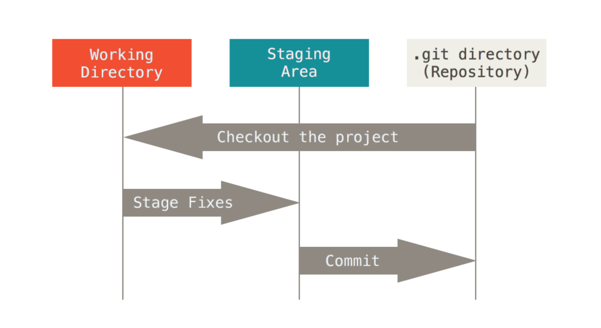

# git-demo

* commit often
* use explicit comments
* learn Markdown


## Getting stuff

```bash
git clone https://github.com/MMSB-MOBI/git-demo.git any_folder_you_like
```

## Everything is local
```bash
ls -lrtha .git/
```

### Creating a branch and monitoring its status

```bash
git checkout -b <YOUR_NAME_work>
git log
touch another_new_file.txt
git status
```

##### Each commit is stored locally under a hashed value (SHA1 key) inside `.git/objects`

### Files are staged (add) then commit



#### stage a file
```bash
git add another_new_file.txt
```

#### unstage a file
```bash
git reset another_new_file.txt
```

#### Any set of added file can be commited

##### Check the status before commiting

```bash
git add another_new_file.txt
git status
```

##### Then write history

```bash
git commit -m 'adding a another new file'
```

**A commit is not supposed to be deleted**.
But files are meant to be freely stages/unstaged prior to commit.

## Registering local branch to remote repository

```bash
git push --set-upstream origin <YOUR_NAME_work>
git push -u origin <YOUR_NAME_work>
```

## The checkout command

##### switch between branch

```bash
git checkout <branch_name>
```

##### Cancel modifications (restore a file to current commit status)

```bash
git checkout <file_name>
```

### Example of conflict management

#### Create & switch to a new branch

```bash
git checkout -b rogue_branch
```

##### Do something in this new branch

```bash
git checkout -b rogue_branch
cat<<EOF > another_file.txt
This is line 1!
This is line 2!
This is line 3!
This is the fourth line!
This is line 5!
This is line 6!
This is line 7!
This is line 8!
EOF
```

#### Doing something opposite in the main branch

```bash
git checkout main
cat<<EOF > another_file.txt
This is line 1!
This is line 2!
This is line 3!
This is line number 4!
This is line 5!
This is line 6!
This is line 7!
This is line 8!
EOF
```

The file `another_file.txt` effectively exists under two different forms. You can switch between **rogue_branch** and **main** to convince yourself.

#### Trying to merge the rogue branch into main branch

##### From the main branch

```bash
git merge rogue_branch
```

* You solve the problem by editing conflicting file(s)
* `git add` those files
* `git commit` to finalize the merge

Sometimes, `git merge` can solve conflict automatically, this is called a fast-forward.
